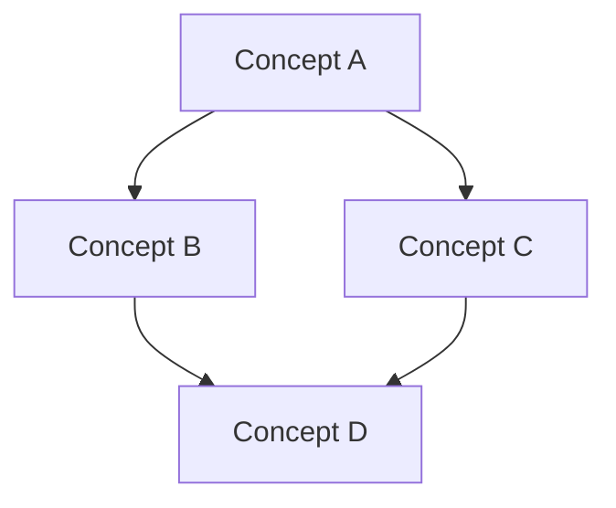

 

# Tutorial Skill

 
Generate a self-contained learning repository for a software-development topic. The repo pairs **theory** (structured markdown with Mermaid visuals) with **practice** (a scaffolded app with milestone-based TODOs that the learner builds commit-by-commit).

 

## When This Skill Triggers

 
The user wants to learn a topic and you need to generate the learning materials. After the repo is generated, the user switches to the **guide** skill to work through the practice steps.

 

## Step 1: Clarify Scope

 
Before generating anything, understand what the learner needs:

 

1. **Topic** — What do they want to learn? (e.g., "GraphQL", "Kubernetes", "React Testing Library")
2. **Level** — Beginner, intermediate, or advanced? If unclear, ask.
3. **Prior context** — Check for a `.guide/learner-profile.md` in the current directory. If it exists, this is a follow-up tutorial. Read the weak points from the previous tutorial and factor them into the theory and practice design.
4. **Practice project** — What kind of app should the hands-on project be? Pick the most natural fit for the topic (e.g., a REST API for "Express.js", a CLI tool for "Go", a component library for "Storybook"). If there are multiple reasonable choices or you're unsure, ask the user.

 
If the user provides a clear topic like "tutorial on Docker", skip unnecessary questions — infer level as beginner and pick a sensible project. Only ask when genuinely ambiguous.

 

## Step 2: Generate the Repo

 
Create a git-initialized repo with this structure:

 

```
learn-<topic>/
├── README.md
├── theory/
│   ├── 01-core-concepts.md
│   ├── 02-controversies.md
│   └── 03-expert-quiz.md
├── practice/
│   └── <project-name>/
│       ├── README.md
│       └── <minimal scaffold>
└── .guide/
    └── learner-profile.md
```

 

### Root README.md

 
A brief overview that orients the learner:

 

```markdown
# Learn <Topic>

 
A structured learning repo: theory to read, code to write.

 

## How to Use

 

1. **Read the theory** — Start with `theory/01-core-concepts.md` to build mental models
2. **Work the practice** — Open `practice/<project>/README.md` and follow the milestones
3. **Use the guide** — Run the `guide` command when you start a milestone to get coaching

 

## Structure

 

- `theory/` — Core concepts, controversies, and an expert-level quiz
- `practice/` — A hands-on project with step-by-step milestones
- `.guide/` — Your learner profile (auto-updated as you practice)

 

## Theory Sections

 
| File                  | Purpose                                                  |
| --------------------- | -------------------------------------------------------- |
| `01-core-concepts.md` | Mental models, key abstractions, how things fit together |
| `02-controversies.md` | The confusing, debated, and criticized parts             |
| `03-expert-quiz.md`   | 10 questions that separate experts from practitioners    |
```

 

### theory/01-core-concepts.md

 
The foundational mental models for the topic. Structure:

 

````markdown
# Core Concepts: <Topic>

 

## Overview

 
<2-3 sentence summary of what this technology/concept is and why it exists>

 

## Concept Map

 

<!-- A Mermaid diagram showing how the core concepts relate to each other -->

 


````

 

## <Concept 1>

 
<Explanation with bullet points. Include a Mermaid diagram if the concept involves a flow, lifecycle, or architecture.>

 

## <Concept 2>

 
...

 

````
 
**Quality bar for concepts:**
- Explain the **why** before the **what** — why does this concept exist? What problem does it solve?
- Use Mermaid diagrams liberally: flowcharts for processes, sequence diagrams for interactions, class diagrams for structures, state diagrams for lifecycles
- Each concept should be self-contained: someone could read just one section and learn something useful
- Cover 5-8 core concepts (not an exhaustive reference — focus on the concepts that unlock understanding)
- If the topic has a mental model or analogy that practitioners use, include it
 
### theory/02-controversies.md
 
The parts that trip people up, spark debates, or are widely criticized. This is where real understanding happens — the nuance that separates someone who read the docs from someone who has used the technology in production.
 
```markdown
# Controversies & Confusions: <Topic>
 
## Common Confusions
 
### <Confusion 1: e.g., "When to use X vs Y">
 
<Explain why this is confusing, what the actual distinction is, and a practical heuristic for deciding>
 
```mermaid
graph TD
    Q{Need to decide?} -->|Condition A| X[Use X]
    Q -->|Condition B| Y[Use Y]
````

 

## Criticisms & Debates

 

### <Criticism 1: e.g., "Too much boilerplate">

 
**The criticism:** <What people say>
**The counterargument:** <The defense>
**The reality:** <Your honest assessment — not a fence-sit, take a position>

 

## Gotchas

 

### <Gotcha 1>

 
<Something that bites people in production but isn't obvious from tutorials>

 

````
 
**Quality bar:**
- Include at least 3 confusions, 2 criticisms, and 2 gotchas
- Take positions — don't be wishy-washy. "Both sides have a point" is not helpful. Say what you'd actually recommend and why.
- These should be things that come up in real engineering discussions, not strawman complaints
 
### theory/03-expert-quiz.md
 
10 questions that distinguish genuine expertise from surface familiarity. These are not trivia — they test understanding of trade-offs, edge cases, and design decisions.
 
```markdown
# Expert Quiz: <Topic>
 
Test your understanding. These questions are designed to distinguish deep expertise from surface knowledge.
 
For each question, think through your answer before revealing the solution.
 
---
 
### Q1: <Question>
 
<details>
<summary>Reveal Answer</summary>
 
<Thorough answer — not just the "what" but the "why" and "when it matters">
 
</details>
 
---
 
### Q2: <Question>
 
<details>
<summary>Reveal Answer</summary>
 
<Answer>
 
</details>
 
...
````

 
**Quality bar for questions:**

 

- Questions should require understanding of trade-offs, not just facts
- At least 3 should involve "it depends" answers where the expert explains what it depends on
- Include questions about failure modes, performance implications, and design decisions
- A senior engineer who has used this technology for 2+ years should get 7-8 right; a beginner should get 2-3

 

### practice/<project-name>/README.md

 
The hands-on project guide, structured as milestones with ordered steps.

 

```markdown
# <Project Name>

 
<1-2 sentence description of what you're building and what you'll learn>

 

## Prerequisites

 

- <What needs to be installed>
- <What the learner should already know>

##  

 

## Milestone 1: <Name> — <What this achieves>

 

> **Goal:** <One sentence describing the outcome>
>
> **Concepts practiced:** <Links to theory sections>

 

- [ ] **Step 1.1:** <Specific, actionable instruction>
        - <Brief explanation of why this step matters>
- [ ] **Step 1.2:** <Next step>
        - <Explanation>
- [ ] **Step 1.3:** <Verification step — how to confirm it works>

##  

 

## Milestone 2: <Name>

 
...
```

 
**Quality bar for milestones:**

 

- 4-7 milestones total — enough to build something real, not so many it feels endless
- Each milestone produces a visible, testable result (the learner can run something and see it work)
- Steps within a milestone are ordered and each one is a single, committable change
- Include verification steps: "Run X and you should see Y"
- The first milestone should produce a working (if minimal) result within 15-30 minutes
- Milestones should build on each other — later ones wouldn't make sense without earlier ones
- Cross-reference theory: each milestone should note which concepts from `theory/` it exercises

 

### practice/<project-name>/ scaffold

 
Generate the minimal project scaffold needed to start Milestone 1. This means:

 

- Package/dependency files (package.json, go.mod, Cargo.toml, requirements.txt, etc.)
- Entry point file (main.go, index.ts, app.py, etc.) — empty or with minimal boilerplate
- Config files (.gitignore, tsconfig.json, etc.)
- **Do NOT pre-build the solution.** The scaffold should be the starting point, not the answer.

 
Pick the language/framework that is most natural for the topic. If the tutorial IS about a specific framework (e.g., "tutorial on Express.js"), use that framework. If the tutorial is about a concept (e.g., "tutorial on event sourcing"), pick the language that best demonstrates it and is most practical for the learner.

 

### .guide/learner-profile.md

 
Initialize an empty learner profile:

 

```markdown
# Learner Profile

 

## Tutorial

 

- **Topic:** <topic>
- **Level:** <level>
- **Started:** <date>

 

## Weak Points

 

<!-- Updated automatically by the guide skill as you practice -->

 

## Session Log

 

<!-- Updated automatically by the guide skill -->
```

 

## Step 3: Initialize Git and Present

 
After generating all files:

 

1. Run `git init` in the repo root
2. Create an initial commit with all generated files
3. Present the repo structure to the user
4. Tell them to start with `theory/01-core-concepts.md`, then move to `practice/<project>/README.md`
5. Remind them to use the `guide` command when they start working on the practice milestones

 

## Multiple Practice Projects

 
A tutorial can have multiple practice projects under `practice/`. This is useful when:

 

- The topic has distinct sub-domains (e.g., a "Kubernetes" tutorial might have `practice/deploy-app/` and `practice/write-operator/`)
- The user explicitly asks for more than one project
- A follow-up tutorial builds on a previous one

 
When adding a practice project to an existing tutorial repo, create it under `practice/` alongside existing projects. Do not modify existing projects.

 

## Follow-up Tutorials

 
When `.guide/learner-profile.md` exists and has weak points from a previous tutorial:

 

- Read the weak points carefully
- Design the theory sections to address those gaps specifically
- Structure the practice milestones so they exercise the weak areas early and repeatedly
- Note in the README that this is a follow-up tutorial and which weak points it targets

 

## Guardrails

 

- Do NOT skip the theory section or treat it as an afterthought — it's half the learning experience
- Do NOT generate a fully-built practice project — the learner builds it
- Do NOT make milestones too granular (30+ steps) or too coarse (2 huge milestones)
- Do NOT use generic examples — tailor everything to the specific topic
- Mermaid diagrams are required in theory, not optional. Use them to show flows, relationships, lifecycles, and architectures
- Every controversy/confusion must take a clear position, not sit on the fence
- Quiz questions must test understanding, not recall

 

## Bundled Resources

 

- `references/topic-mapping.md` — Quick reference for mapping topics to project types, tech stacks, and milestone sizing. Read this when deciding what kind of practice project to scaffold.
